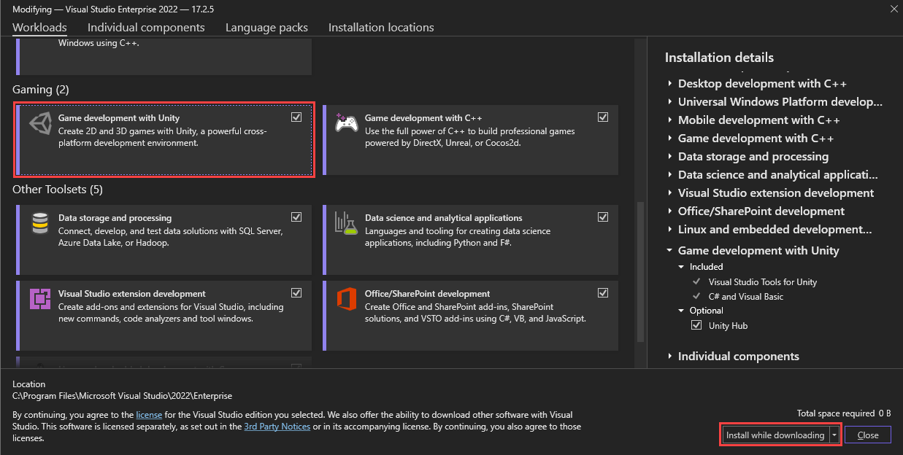

# Git_&_Unity_101
How to use Git and Unity with a group of Game Makers.

## Table of contents
[Part 0: Background](https://github.com/vittorio-corbo/Git_-_Unity_101/blob/main/README.md#part-0-background)

[Part 1: Account Setup](https://github.com/vittorio-corbo/Git_-_Unity_101/blob/main/README.md#part-1-account-setup)

[Part 2: Install and Setup Software](https://github.com/vittorio-corbo/Git_-_Unity_101/blob/main/README.md#part-2-install-and-setup-software)

[Part 3: Setup Project to work with Github](https://github.com/vittorio-corbo/Git_-_Unity_101/blob/main/README.md#part-3-setup-project-to-work-with-github)

[Part 4: How to work in the project](https://github.com/vittorio-corbo/Git_-_Unity_101/blob/main/README.md#part-4-how-to-work-in-the-project)

[Conclusion](https://github.com/vittorio-corbo/Git_-_Unity_101/blob/main/README.md#part-4-how-to-work-in-the-project)

[Future Resources](https://github.com/vittorio-corbo/Git_-_Unity_101/blob/main/README.md#part-4-how-to-work-in-the-project)

## Part 0: Background
pizza

## Part 1: Account Setup
In here we will create accounts all the prerequisite software necessary to work.
1. [Create Github Account](https://learn.microsoft.com/en-us/visualstudio/version-control/git-create-github-account?view=vs-2022)
   * What is Git? Git is essential for software development, offering a version control system that tracks changes and allows for easy reversion to previous states. It allows seamless collaboration among developers by providing each one with a complete history and files of the project, stored in a decentralized repository thanks to black magic.
2. [Create Unity Account](https://support.unity.com/hc/en-us/articles/208626336-How-do-I-create-a-Unity-ID-account)
   * What is Unity? Unity is a well-known game engine that can make 2D, 3D, and VR games.
   * Obtain a License: A default personal license should be sufficient. However, consider getting a student license if you are qualified.
     * Learn more about eligibility and benefits of the [Unity Student Plan](https://unity.com/products/unity-student)
You can continue with a personal license while waiting for approval.
   
## Part 2: Install and Setup Software
To be able to make games collaborative we will need to create all the software necessary to do so. This means: installing a game engine (unity), a version control (github), and a way to write code (visual studio).
1. Install Unity
   1. [Install Unity hub](https://unity.com/download)
      
      * Unity Hub is your one stop shop which houses your installations of the Unity Engine. Which allows you to change your version of Unity depending on the project version you are working on.
      * Note: While the engine can be downloaded without hubs, this isn’t recommended. If you still want to download the engine by itself you can learn more at: https://docs.unity3d.com/Manual/ManualActivationGuide.html
   3. Install a Unity Version
      1. In the Unity Hub, go to the “Installs” tab on the left. Click “Install Editor” option.
      
         
      2. Choose a version depending on projects and features, LTS (Long Time Support) versions are recommended for stability.
           * Install the version corresponding to the project you are in. Everyone within the same project should use the same version of the Unity Engine.
                * Note that sometimes the required version of the specific project might not be shown in the pop-up menu on your Unity Hub. In that case, you may need to click the “download archive” option under the “Archive” tab. This will lead you to find the right versions you need.
                  
           * If you are choosing your own version of the Unity Engine for the project, it is recommended to choose an LTS version.
           * Funny Note:  follow the rule of Three F. If it has a 3 in the second digit and an f. For example: 2022.3.xxfx. These versions will also have tags to indicate they are LTS versions.
      4. In the Add Modules pop-up page (These are additive things you can attach to Unity, which allows you to have new languages, Vr, or other stuff)
           * Build support: Add any platform build supports based on your operating system & your audience's operating system. For example:
                * If you are making computer games that will function on Windows and Mac systems, you check the boxes for Windows Build Support and Mac Build Support (select both IL2CPP and Mono variants unless only one option is present on your platform).
           * Language: The default Language for Unity Editor will be English. If you need additional language options, you can add whatever Language Packs that you are more comfortable working with.
           * Documentation: This is highly recommended as it aids you in navigating through the Unity Editor and scripting C#.
           * Visual Studio Community: Visual Studio Community Edition is recommended for code editing IDE.
             *  If you choose Visual Studio to be your default script editor yet it is not integrated correctly, visit this site for more instructions: https://docs.unity3d.com/Manual/VisualStudioIntegration.html
             * When you install Visual Studio, you want to have Tools for Unity Visual Studio Extension, check the box in the “Workloads” tab when installing
                   

2. Install Git
   * [Install Git Desktop](https://desktop.github.com/)
       * This is more beginner-friendly as it provides you with an intuitive interface on how to use Git features if you are not familiar with writing commands manually.
   * [Install Git Bash](https://git-scm.com/downloads) Alternatively you can do this
     * This is the alternative and harder version of managing version control. This is NOT recommended for beginners. If you have experience with working from the terminal you can use this.

3. [Install Visual Studio](https://visualstudio.microsoft.com/downloads/)
   * Note: You do not have to do this if you Installed Visual Studio in the (Add Modules Step). If you didn't you can install it and connect it here.
   * Install Tools for Unity Visual Studio Extension, integrate Visual Studio to Unity, and set it as the default editor. (Link it back to the earlier instructions)

## Part 3: Setup Project to work with Github
Before we can create games, we need to create our project in Unity, and then link it to a version of it in Github.
1. Creating a New Unity Project (if you are starting from scratch)
   1. Within Unity Hub, click “New project”
      
   2. Select an editor version that you have installed to develop this project. 
      
   3. In the middle scroll-down menu, choose a template that you wish to start on.
      
   4. On the right side, configure your project settings. Once finished, click “Create project”.
            
         
2. Hooking up a Unity Project to Github
   1. [Creating a repo](https://docs.github.com/en/repositories/creating-and-managing-repositories/quickstart-for-repositories)
        1. Set repo visibility:
            * Private: A private repository is visible only to the repository owner, and to any users or organizations the owner has granted access. This means that the source code, issues, and any other repository data are hidden from anyone not explicitly permitted to view or contribute. Private repositories are ideal for work on personal projects or anything that is not ready to be shared.
            * Public: Public repositories are accessible to anyone on the internet. This means that anyone can see the source code, clone the repository, and submit issues or pull requests. This is great for open-source projects and community collaboration.
        2. Add: .gitignore 
            * Unity generates temporary files, builds assets, log files, and other project files that shouldn't be included in version control. Including these files in Git can significantly increase the size of your repository and lead to conflicts when several developers work on the same project. To prevent Git from tracking these files, you can add a .gitignore file to your project directory, instructing Git to ignore them.
        3. Optional: add README. The README file in a project acts as the first point of information for anyone who encounters the project, offering an overview of what the project is about, how to install and use it, and any other relevant details that you wish your audience to know.

            * PUT WHICH VERSION OF THE ENGINE YOU ARE USING.
            * If you are working with others this is a MUST
            * If you want to go all out writing a nice readme look here to see how to write an effective README: https://www.freecodecamp.org/news/how-to-write-a-good-readme-file/
                * Fun Note: this entire document you are reading is a READ.ME
        4. git add origin
        5. Push
3. Working on Someone else's project
   1. [Collaborator](https://www.geeksforgeeks.org/what-are-github-collaborators/)
        * Why have collaborators? Collaborators are people who have the same access to a repo as you do (mostly). You should only have collaborators if these are people you trust personally, and are members who should have write and read privileges to the repository.

   2. [Not a collaborator](https://docs.github.com/en/pull-requests/collaborating-with-pull-requests/working-with-forks/fork-a-repo)
        * FORKING
        * Why have forking? If you are working on a project where you want to take charge of what is being changed to your repository, you should have forking. This allows people on the internet to see

      
## Part 4: How to work in the project
Now that everything has been setup, this section will show you will operate within your working environment. Moreover, some good practices that will save you many a headache.

Note: If you are using git bash, you can still follow these instructions, but the specific ways to do this will be in the following link

Git Normal
1. Pull the latest version
     * (Fork it maybe)
     * Git clone
     * DO THIS FOR BOTH GIT BASH AND DESKTOP (if not choose one)
2. Do not work on the same scene!
     * Unity scenes are complex binary files that represent the spatial arrangement and settings of all objects in a particular game scene. Working on the same scene simultaneously will lead to merge conflicts that are hard to manually solve due to the binary nature of these files.
     * It is recommended that each teammate should create their own version of the main scene and work on it. A good file management practice is to name your unique scene file with your name. For example: VittoMainScene
3. Merge Conflict
     * If merge conflicts happen in a C# script that is manually coded, approach it with this guide: https://www.freecodecamp.org/news/resolve-merge-conflicts-in-git-a-practical-guide/
     * When Unity Scene files merge conflict does happen, the easiest approach would be to only keep one version of the scene file and remove all other changes.

[Git Bash](https://product.hubspot.com/blog/git-and-github-tutorial-for-beginners)

## Conclusion
pizza

## Future Resources
pizza

THE END
