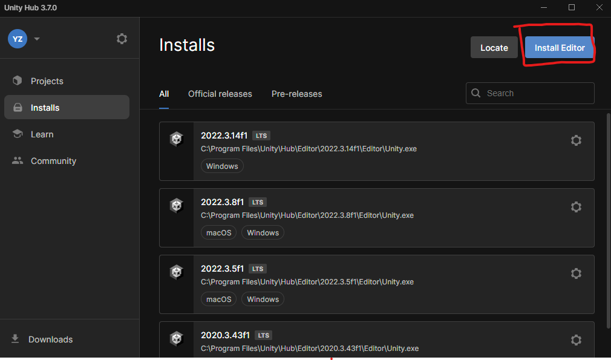
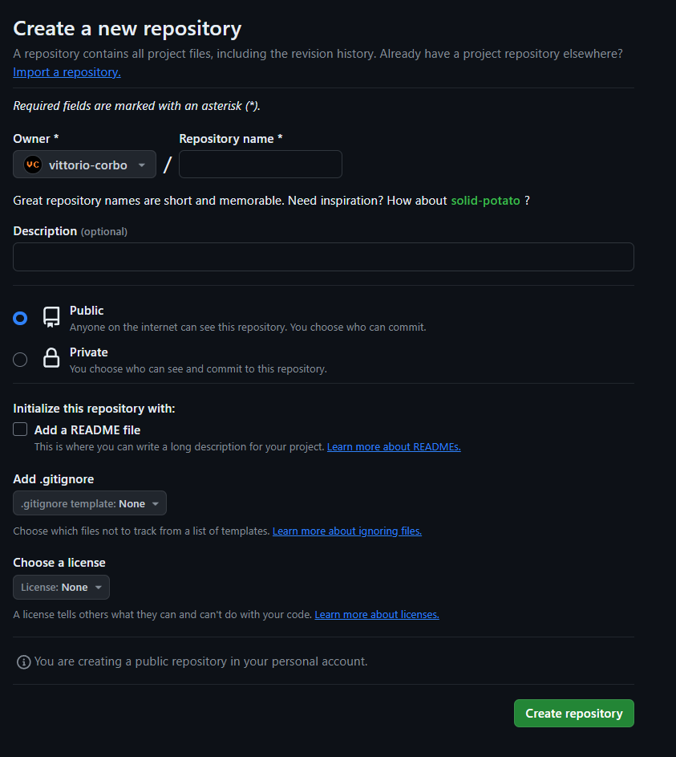

# Git_&_Unity_101
Want to make game with others? Want to make games by yourself? Want to keep track of your software? Well this guide will let you know how to use Github and Unity, to follow these aspirations.

## Table of Contents
* [Background](https://github.com/vittorio-corbo/Git_-_Unity_101/blob/main/README.md#background)

* [Part 1: Account Setup](https://github.com/vittorio-corbo/Git_-_Unity_101/blob/main/README.md#part-1-account-setup)

* [Part 2: Install and Setup Software](https://github.com/vittorio-corbo/Git_-_Unity_101/blob/main/README.md#part-2-install-and-setup-software)

* [Part 3: Setup Project to work with Github](https://github.com/vittorio-corbo/Git_-_Unity_101/blob/main/README.md#part-3-setup-project-to-work-with-github)

* [Part 4: How to work in the project](https://github.com/vittorio-corbo/Git_-_Unity_101/blob/main/README.md#part-4-how-to-work-in-the-project)

* [Conclusion](https://github.com/vittorio-corbo/Git_-_Unity_101/blob/main/README.md#conclusion)

* [Future Resources](https://github.com/vittorio-corbo/Git_-_Unity_101/blob/main/README.md#future-resources)

## Background
This is an introductory guide for aspiring game developers, especially those who are new to participating in a Video Game Design Club such as [VGDev](https://www.gtvgdev.com/) or making games in general. 
**In this Tutorial we use Unity and Git.**

**Topics:**

* [A. What is Unity?](https://github.com/vittorio-corbo/Git_-_Unity_101/blob/main/README.md#what-is-unity)

* [B. Why use Git?](https://github.com/vittorio-corbo/Git_-_Unity_101/blob/main/README.md#why-use-git)

### A. What is Unity?

* Unity is a well-known and highly versatile game engine that can make 2D, 3D, and VR games for various platforms. It is extremely powerful yet has a user-friendly interface and a supportive community for game developers to bring their game vision to life. As a whole, it is one of the most popular game engines, especially for smaller to midsize teams.
* Alternatives: Unity as a company can cause controversies sometimes. If you want to make a game, also think about other alternatives such as Godot, Unreal, and GameMaker for 2D games. As a whole, each engine has its own use cases, so make sure that you are using the right tool for the job.
    * https://www.brsoftech.com/blog/advantages-and-disadvantages-of-best-game-engines/
    * This is not an exhaustive list, there is a whole ocean of game engines.
  
### B. Why use Git?
* Git is essential for software development, offering a version control system that tracks changes and allows for easy reversion to previous states. It allows seamless collaboration among developers by providing each one with a complete history and files of the project, stored in a decentralized repository thanks to black magic.
* Alternatives: there are other types of types of version control, such as Perforce. Each has pros and cons, so just know that you are not stuck with Git. However, git is the most popular version control system among developers.

## Part 1: Account Setup
In here we will create accounts all the prerequisite software necessary to work.

**Topics:**

* [A. Hardware](https://github.com/vittorio-corbo/Git_-_Unity_101/blob/main/README.md#a-hardware)

* [B. Create Github Account](https://github.com/vittorio-corbo/Git_-_Unity_101/blob/main/README.md#b-create-github-account)

* [C. Create Unity Account](https://github.com/vittorio-corbo/Git_-_Unity_101/blob/main/README.md#c-create-unity-account)

### A. Hardware
* Have a computer powerful enough to run Unity. A good rule of thumb is if you can play a standard computer game in it, it should be fine. [More requirement information](https://docs.unity3d.com/Manual/system-requirements.html)
### B. [Create Github Account](https://learn.microsoft.com/en-us/visualstudio/version-control/git-create-github-account?view=vs-2022)
* **Note**: creating a good set of repositories and projects you have worked on, is a great way to show your skills as a gamemaker. 
### C. [Create Unity Account](https://support.unity.com/hc/en-us/articles/208626336-How-do-I-create-a-Unity-ID-account)
* Obtain a License: A default personal license should be sufficient. However, consider getting a student license if you are qualified.
   * Learn more about eligibility and benefits of the [Unity Student Plan](https://unity.com/products/unity-student)
   * You can continue with a personal license while waiting for approval.
   
## Part 2: Install and Setup Software
To be able to make games collaborative we will need to create all the software necessary to do so. This means: installing a game engine (Unity), a version control (Github), and a way to write code (Visual Studio).

**Topics:**

* [A. Install Unity](https://github.com/vittorio-corbo/Git_-_Unity_101/blob/main/README.md#a-install-unity)

* [B. Install Git](https://github.com/vittorio-corbo/Git_-_Unity_101/blob/main/README.md#b-install-git)

* [C. Install Visual Studio](https://github.com/vittorio-corbo/Git_-_Unity_101/blob/main/README.md#c-install-visual-studio)

### A. Install Unity
   1. [Install Unity hub](https://unity.com/download)
      
      * Unity Hub is your one stop shop which houses your installations of the Unity Engine. Which allows you to change your version of Unity depending on the project version you are working on.
      * **Note**: While the engine can be downloaded without hubs, this isn’t recommended. If you still want to download the engine by itself you can learn more at: https://docs.unity3d.com/Manual/ManualActivationGuide.html
   3. Install a Unity Version
      1. In the Unity Hub, go to the “Installs” tab on the left. Click “Install Editor” option.
      
         
      2. Choose a version depending on projects and features, LTS (Long Time Support) versions are recommended for stability.
           * Install the version corresponding to the project you are in. Everyone within the same project should use the same version of the Unity Engine.
                * **Note** that sometimes the required version of the specific project might not be shown in the pop-up menu on your Unity Hub. In that case, you may need to click the “download archive” option under the “Archive” tab. This will lead you to find the right versions you need.
                  
           * If you are choosing your own version of the Unity Engine for the project, it is recommended to choose an LTS version.
           * **Funny Note**:  follow the rule of Three F. If it has a 3 in the second digit and an f. For example: 2022.3.xxfx. These versions will also have tags to indicate they are LTS versions.
      4. In the Add Modules pop-up page (These are additive things you can attach to Unity, which allows you to have new languages, VR, or other stuff)
           * **Build support**: Add any platform build supports based on your operating system & your audience's operating system. For example:
                * If you are making computer games that will function on Windows and Mac systems, you check the boxes for **Windows Build Support** and **Mac Build Support** (select both IL2CPP and Mono variants unless only one option is present on your platform).
           * **Language**: The default Language for Unity Editor will be English. If you need additional language options, you can add whatever Language Packs that you are more comfortable working with.
           * **Documentation**: This is highly recommended as it aids you in navigating through the Unity Editor and scripting C#.
           * **Visual Studio Community**: Visual Studio Community Edition is recommended for code editing IDE.
             *  If you choose Visual Studio to be your default script editor yet it is not integrated correctly, visit this site for more instructions: https://docs.unity3d.com/Manual/VisualStudioIntegration.html
             * When you install Visual Studio, you want to have Tools for Unity Visual Studio Extension, check the box in the “Workloads” tab when installing
                   
### B. Install Git
   * [Install Git Desktop](https://desktop.github.com/)
       * This is more beginner-friendly as it provides you with an intuitive interface on how to use Git features if you are not familiar with writing commands manually. 
   * OR
   * [Install Git Bash](https://git-scm.com/downloads) 
     * This is the alternative and harder version of managing version control. This is **NOT** recommended for beginners. If you have experience with working from the terminal you can use this.
     * **Fun Fact**: if you installed Git Desktop you automatically have access to Git Bash
     
### C. [Install Visual Studio](https://visualstudio.microsoft.com/downloads/)
   * **Note**: You do not have to do this if you Installed Visual Studio in the (Add Modules Step). If you didn't you can install it and connect it here.
   * Install Tools for Unity Visual Studio Extension, integrate Visual Studio to Unity, and set it as the default editor. (Link it back to the earlier instructions)

## Part 3: Setup Project to work with Github
Before we can create games, we need to create our project in Unity, and then link it to a version of it in Github.

**Topics:**

* [A. Creating a New Unity Project (if you are starting from scratch)](https://github.com/vittorio-corbo/Git_-_Unity_101/blob/main/README.md#a-creating-a-new-unity-project-if-you-are-starting-from-scratch)

* [B. Hooking up a Unity Project to Github](https://github.com/vittorio-corbo/Git_-_Unity_101/blob/main/README.md#b-hooking-up-a-unity-project-to-github)

* [C. Hooking up Local project to git](https://github.com/vittorio-corbo/Git_-_Unity_101/blob/main/README.md#c-hooking-up-local-project-to-git)

* [D. Collaborative development in the repo](https://github.com/vittorio-corbo/Git_-_Unity_101/blob/main/README.md#d-collaborative-development-in-the-repo)

* [E. Pull the project](https://github.com/vittorio-corbo/Git_-_Unity_101/blob/main/README.md#e-pull-the-project)

### A. Creating a New Unity Project (if you are starting from scratch)
   1. Within Unity Hub, click “New project”
      
   2. Select an editor version that you have installed to develop this project. 
      
   3. In the middle scroll-down menu, choose a template that you wish to start on.
      
   4. On the right side, configure your project settings. Once finished, click “Create project”.
            

### B. Hooking up a Unity Project to Github
   1. [Creating a repo](https://docs.github.com/en/repositories/creating-and-managing-repositories/quickstart-for-repositories) \
      
        1. Give it a name & description
            * Naming your repository and providing a description helps others understand the purpose and content of your project at a glance, facilitating easier discovery and collaboration.  
        2. Set repo visibility:
            * **Private**: A private repository is visible only to the repository owner, and to any users or organizations the owner has granted access. This means that the source code, issues, and any other repository data are hidden from anyone not explicitly permitted to view or contribute. Private repositories are ideal for work on personal projects or anything that is not ready to be shared.

            * **Public**: Public repositories are accessible to anyone on the internet. This means that anyone can see the source code, clone the repository, and submit issues or pull requests. This is great for open-source projects and community collaboration.
               * **Privacy Note**: Making it public means there are risks for exposure of sensitive data, unauthorized modifications, and concerns regarding copyrights, so make sure you are ready for this.

        3. Add README (Optional):
            * The README file in a project acts as the first point of information for anyone who encounters the project, offering an overview of what the project is about, how to install and use it, and any other relevant details that you wish your audience to know.
            * PUT WHICH VERSION OF THE ENGINE YOU ARE USING.
               * If you are working with others this is a MUST, as it reduces you headaches.
            * If you want to go all out writing a nice readme, learn [how to write markdown files/README's](https://www.freecodecamp.org/news/how-to-write-a-good-readme-file/) (markdowns are the file format of README's).
            * **Fun Note**: this entire document you are reading is a README.

        5. Add: .gitignore:
            * Unity generates temporary files, builds assets, log files, and other project files that shouldn't be included in version control. Including these files in Git can significantly increase the size of your repository and lead to conflicts when several developers work on the same project. To prevent Git from tracking these files, you can add a .gitignore file to your project directory, instructing Git to ignore them. \
                    
        7. [Choose a License](https://docs.github.com/github/creating-cloning-and-archiving-repositories/licensing-a-repository) (Optional):
           * **Copyright Note**: in general make sure you own all the assets you use, and if not that you are using the right type of [attributions](https://ecampusontario.pressbooks.pub/authoringguide/chapter/attribution-statements/) for your work.
        8. Click the “Create repository” option
### C. [Hooking up Local project to git](https://docs.github.com/en/migrations/importing-source-code/using-the-command-line-to-import-source-code/adding-locally-hosted-code-to-github)
   * Linking your project directory to a Git repository, enabling version control and collaboration.
     
### D. Collaborative development in the repo
   1. [Collaborator](https://www.geeksforgeeks.org/what-are-github-collaborators/)
        * Why have collaborators? Collaborators are individuals who generally have the same level of access to a repository as you do. You should only add collaborators whom you trust and who are deemed necessary to have read and write privileges to the repository.
        * https://www.geeksforgeeks.org/what-are-github-collaborators/
   2. Not a collaborator
        * Forking: Forking in GitHub is the process of creating a copy of someone else's repository to your account. This allows you to freely experiment with changes without affecting the original project. 
        * Why have forking? Forking is useful when you want to maintain control over the changes made to your repository. It allows others to view and contribute to your project while giving you the power to review and integrate those changes as you will.
https://docs.github.com/en/pull-requests/collaborating-with-pull-requests/working-with-forks/fork-a-repo

### E. Pull the project
   1. **Note**: This step is only relevant when you're working on someone else's project and have checked out step 4.
   2. [Tutorial on how to clone the repository locally](https://docs.github.com/en/repositories/creating-and-managing-repositories/cloning-a-repository)
      * After this you should have the project on your machine
   3. How to make the project appear in Unity Hub
      1. In Unity Hub, click the “Add” button \
         
      3. Locate the folder that contains the project that you just cloned in the pop-up file explorer. Click Open \
         
      5. Click on the project in Unity Hub to open it. Unity will take a long time to open a project for the first time due to temporary file creation, so be patient.

      
## Part 4: How to work in the project
Now that everything has been set up, this section will show you will operate within your working environment. Moreover, some good practices that will save you many headaches.

**Topics:**

* [A. How to Git](https://github.com/vittorio-corbo/Git_-_Unity_101/blob/main/README.md#a-creating-a-new-unity-project-if-you-are-starting-from-scratch)

* [B. How to work in Unity with Git ](https://github.com/vittorio-corbo/Git_-_Unity_101/blob/main/README.md#b-hooking-up-a-unity-project-to-github)

### A. How to Git
  * While extremely important we will not go in-depth on how to use git here. Here are some good guides depending in how you operate Git.
     * [Git Desktop guide](https://www.youtube.com/watch?v=RPagOAUx2SQ)
     * [Git Bash](https://product.hubspot.com/blog/git-and-github-tutorial-for-beginners)
  * **Note**: learning how to use git is impossible, you will always be learning it, so be patient.
### B. How to work in Unity with Git 
  1. Before you begin working
     1. Ensure your local repository is up-to-date with the latest changes
        * If you're a contributor or owner, directly pull the latest updates.
        * For forked projects, first synchronize your online repository with the original's most recent version, then pull the updates to your local repository.  
        * Pulling Local merge conflicts
           * **Stash changes**: Temporarily shelving (or "stashing") changes allows you to save your current work progress without committing it. This is useful for clearing your working directory to pull new changes from the repository, after which you can reapply your stashed changes.
           * **Discard**: Discarding changes removes any modifications you've made to your working directory that haven't been committed. This is helpful when you want to reset your files to their last committed state, effectively ignoring any recent, uncommitted edits before pulling updates.
     2. Ensure you have the newly pulled changes present in your Unity project.
        * If unsure reload the scene
     3. Ensure you have the newly pulled changes present in your Unity project.
        * Do not work on the same scene!
           * Unity scenes are complex binary files that represent the spatial arrangement and settings of all objects in a particular game scene. Working on the same scene simultaneously will lead to merge conflicts that are hard to manually solve due to the binary nature of these files.
           * It is recommended that each teammate should create their own version of the main scene and work on it. A good file management practice is to name your unique scene file with your name. For example: VittoMainScene

  2. While your working
     * USE PREFABS
        1. Prefabs are pre-configured, reusable game objects that you can create in Unity for repeated use.
        2. Inform your collaborators regarding prefab additions and changes.
        3. When you make changes to prefabs, override it so it applies to all existing instances of the prefabs (apply changes globally).
           * After you edited the prefab object within a scene, click the override button in the right side inspector when selecting it. Then click “Apply All”.  
           * You can safely discard scene changes after you override the changes to the prefab.
        4. You could also unpack a prefab to a scene.  It allows you to break the instance connection between the scene object and its source prefab. This action enables you to make specific adjustments or modifications to that instance without affecting the original prefab or any of its other instances.
           * To do this, right click on the prefab object in the hierarchy, then navigate to Prefab - Unpack Completely 
        6. **Note**: sometimes people use tooling to automate the creation of essential objects. Thus instead of manually adding them into a Scene, a tool will make it for you. Thus, you can decouple the need to drag-in objects into a room, reducing merge conflicts when creating new essential prefabs.

     * Make sure you refrain from commit Scene changes unless necessary. This practice helps to prevent potential conflicts with other contributors' work as discussed earlier.

  3. Before you push
     * Double-check that all the changes, files, or updates you intend to push are accurately staged for the commit.
     * Discard unnecessary changes to maintain a clean and relevant project history and avoid any unnecessary conflicts.
     * If you are making scene changes
        * Ensure that you've saved the updated scene in Unity with ctrl + s. Unity scenes do not automatically save your latest changes.

  4. Pushing
     * Merge conflicts when pushing.
        * If merge conflicts happen in a C# script that is manually coded, [learn how to resolve them](https://www.freecodecamp.org/news/resolve-merge-conflicts-in-git-a-practical-guide/)
        * When Unity Scene files merge conflict does happen, the easiest approach would be to only keep one version of the scene file and remove all other changes.
     * Have rules for pull requests is essential in managing a collaborative development environment efficiently and maintaining high-quality code standards.
        * [Best practices for pull requests](https://docs.github.com/en/pull-requests/collaborating-with-pull-requests/getting-started/best-practices-for-pull-requests)

  5. Builds
     * Make sure they are in .gitignore and you do not push it. 

## Conclusion
Our guide primarily introduces the basics of working on games, whether collaboratively or solo. However, managing a project extends beyond these initial steps. It's crucial to track tasks and maintain communication within your team. Therefore, we encourage you to explore additional resources to elevate your game development journey further.

## Future Resources
Learn about other tools and resources to take your gamemaking abilities to a new level.

**Topics:**

* [A. Getting to learn the basics of Unity](https://github.com/vittorio-corbo/Git_-_Unity_101/blob/main/README.md#a-getting-to-learn-the-basics-of-unity)

* [B. Task Management](https://github.com/vittorio-corbo/Git_-_Unity_101/blob/main/README.md#b-task-management)

* [C. Communication](https://github.com/vittorio-corbo/Git_-_Unity_101/blob/main/README.md#c-communication)

### A. Getting to learn the basics of Unity
   * If you are new to Unity and want to learn how to use it, go ahead and start in a classic project.
      * [Roll-a-ball tutorial](https://learn.unity.com/project/roll-a-ball)
### B. Task Management
   * You should find a way to organize the work that needs to be done. This is a good way to keep you on schedule and focused. This is even more important when working with others.
      * [Trello](https://trello.com/)
      * [Taiga](https://taiga.io/)
### C. Communication
   * Having a way to communicate with your team is crucial for game development. Having an official channel for communication, puts all your information pertaining your game in one place.
   * [Discord](https://www.ionos.com/digitalguide/server/know-how/how-to-set-up-a-discord-server/)

THE END
